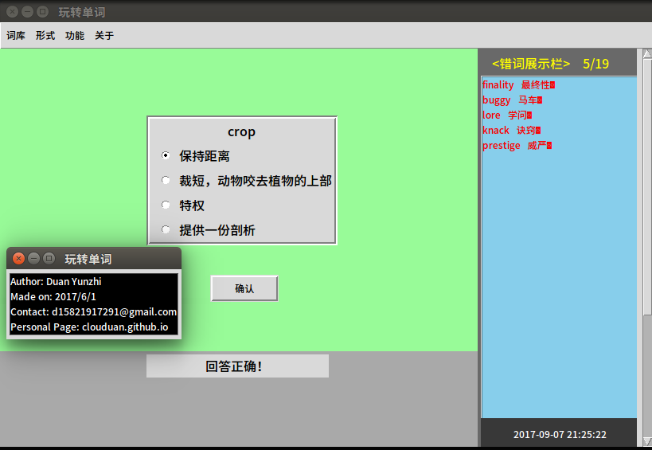

# WordPlayer
  

`setup.py` 为主程序.  
`Texts` 存放英文文本(格式必须是utf-8编码不带BOM)，及程序从中分析出的单词     
`Users` 存放用户信息，及用户的专用词库   
`Lexicon` 存放单词词库，包括四六级单词，及用户定义的词库(必须是utf-8编码格式不带BOM) 

#  Introduction
## 1.启动    
推荐在idle中打开`setup.py`并运行，不推荐在terminal运行（注意要在程序所在目录运行，否则会导致文件的相对路径出错！）   
## 2.登录   
本应用已预置一个账号 <用户名admin密码python>，您也可以另外注册。推荐用系统自带输入法，对搜狗等第三方输入法支持不太好（退格键失效）。  
## 3.做题   
点击`词库`-`形式`，选择`选择题`或`填空题`，即可进入考察模式。用户可以选四六级词库也可以在文件对话框中选其它或自己添加的词库。
程序带有储错功能，对答错的单词有专门存档（User/?-misWords）,还有正确率评估。   
## 4.增词   
点击`功能`-`增词`，输入需要添加到用户私人词库的单词，程序会自动查找翻译并存储在私人词库中。   
## 5.查词    
点击`功能`-`查词`，输入要翻译的单词，按回车。程序默认先在本地查找，查询不到再进行网络查找。   
## 6.析词   
点击`功能`-`分析`，选取一篇文本，即可分析出里面的四六级单词并保存（在./Texts文件夹下），一般等待时长为5~10秒左右。   

#  License

[MIT](https://github.com/clouduan/WordPlayer/blob/master/LICENSE)
